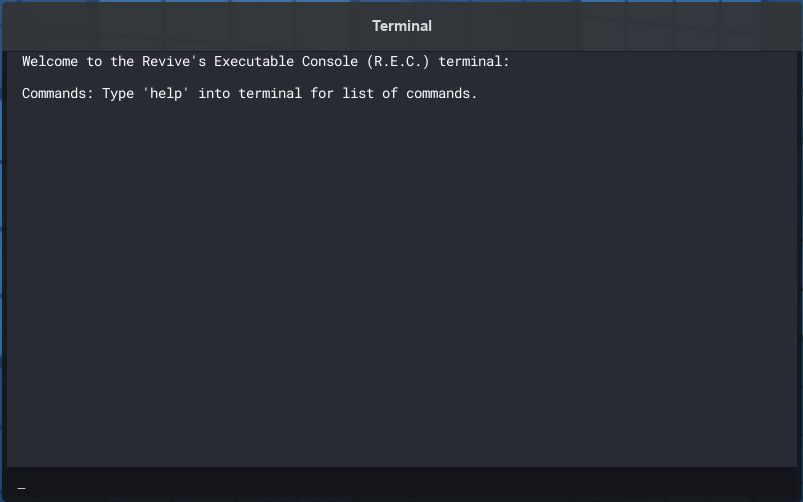
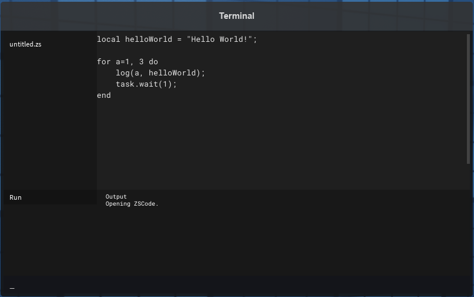

Welcome to Z-Sharp.

ZSharp runs on a sandboxed `lua` environment on the Revive engine.

1. [Getting Started](#getting-started-using-zsharp)
2. [Terminal](#terminal)
3. [ZSCode](#zscode)
4. [Libraries](#libraries)
5. [Examples](#examples)
6. [Why It's Made](#why-its-made)

### Getting Started using ZSharp:
- Locate and open up a terminal in [game](https://www.roblox.com/games/141084271/Rise-of-the-Dead).

---
## Terminal



The terminal mimicks a unix-based terminal but currently it has no file structure.

There are **two ways of running ZSharp**:
1) Using the `run` command on the terminal, anything after the `run` command will be interpreted as ZSharp.

```lua
run log("Hello World!");
```

2) Run the `code` command which brings up **ZSCode**, a text editor mimicking **VSCode**.

>⚡You can use `fullscreen` to fullscreen the terminal.

---
## ZSCode



Currently, you'll be defaulted to `untitled.zs` and there are no saving and loading functionality. The output which was once the terminal's output will now show up as the output window.

To run your script, you can press the **Run** button on the bottom left.

>⚡You can close **ZSCode** by entering `code` command again into the bottom.

---


## global & Instances and Classes

<a name="libraries"></a>
- [global](docs/global)
- [Instances](docs/Instance.md)
- [Classes](docs/Class.md)

---
### Examples
These are examples of what you can currently do in ZSharp.

---

`void` **help**(path: *string*)
**ZSharp** has a built in `help` function to list available libraries and shows it's hints and descriptions.

> More info [here](docs/global#help)

Try running some of these in `run` or `code`.
```lua
help("Audio.Play"); -- Shows you how to use Audio.Play.

help("Instance.Classes"); -- Shows you all available classes

help("Instance.List"); -- Shows you how to use Instance.List.
```

---

#### Playing a sound
```lua
Audio:Play("Boombox:Stepping Up");
```

This plays the sound called `Boombox:Stepping Up` since it exists in the Revive engine, but you can do more since [`Audio:Play`](docs/Class/Audio.md#play) returns a [Sound](docs/Instance/Sound.md), you can use their methods and change their properties. `run help("Instance.Classes.Sound")` for more.

>⚡To stop the sound. Use `Instance:DestroyList("Sound", true)`. Which destroys all instances matching the word `Sound` in its name.
>
>More info on [Instance](docs/Instance)

```lua
local sound = Audio:Play("Boombox:Stepping Up");
sound.Volume = 1;

task.wait(5);
sound:Destroy();
```
---

#### Spawning an instance

```lua
local sound = new("Sound"){
    SoundId = "rbxassetid://142376088"; -- Parry Gripp - Raining Tacos
};

sound:Play(); -- Plays the newly spawned sound.
```

> More info on [`new(className: *string*)`](docs/global#new).

---

### Why it's made

- The idea for this is ambitious, with the development of [Almonds](https://www.roblox.com/games/5623142930/Almdes), we are hoping to incoorporate modded servers in the game. This provides a ease of access to create a modded Almonds server.
    - To let community servers decide for themselves how their community want the world to be played.
    - To also be able to create custom community content derived from the base game. 
- This can also be utilized for some high level puzzle solving minigame.
- But mostly, this was just fun to work on for me.